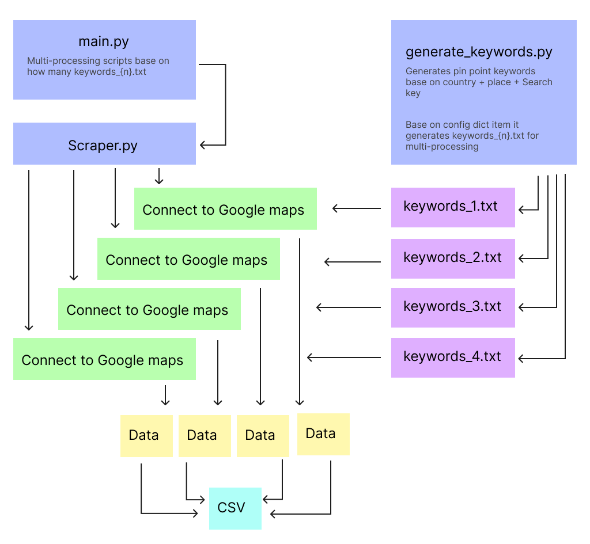

# Google Maps Business Scraper  


The **Google Maps Business Scraper** is a Python-based tool for extracting detailed business information from Google Maps. It’s designed for efficiency, scalability, and ease of use, making it perfect for businesses, researchers, and analysts.


## Key Features

- **Proxy Rotation**: Minimizes the risk of IP blocks by Google Maps, `ensuring continuous scraping`.
- **Keyword Generator**: Creates detailed and specific keywords to `maximize data collection` efficiency.
- **Browser Refresh**: Automatically refreshes the browser, proxy, and appends data to the CSV after each batch to `optimize RAM usage` and system performance.
- **Batch Processing**: Runs multiple scripts simultaneously, drastically `reducing processing time`.
- **Progress Tracking**: Each process displays an `individual progress bar` for clear and real-time updates.
- **Easy Resume**: Automatically resumes from the leftover `keywords.txt` and continues appending new data to the CSV


## Installation

1. Clone the Repository

   ```bash
   git clone https://github.com/xgino/Google-Map-Scraper.git  
   cd Google-Map-Scraper  
   ```

2. Install Dependencies

   ```bash
   pip install -r requirements.txt  
   playwright install  
   ```

## Usage
1. Generate Keywords

   ```bash
   cd generate_keywords  
   python generate_keywords.py
   ```
   Edit `country`, `places`, and `keywords` in the script to suit your needs.

2. Run the Scraper

   ```bash
   cd ..  # Go back to the root directory  
   python main.py  
   ```



## Scraper Output  
The scraped data is saved in `./data/data.csv` with the following columns:

- **name**: Business name
- **address**: Business address
- **website**: Business website
- **phone**: Phone number
- **reviews_count**: Number of reviews
- **reviews_average**: Average review rating
- **latitude**: Latitude of the business
- **longitude**: Longitude of the business
- **search_keyword**: Keyword used for search


## Considerations and Potential Challenges
- **Google Maps Updates**: Changes to Google Maps' HTML structure might require script updates to maintain functionality.
- **Proxy Maintenance**: The `socks5.txt` file must be manually updated with valid and working proxies to ensure uninterrupted scraping.
- **Hardware Limits**: Scaling to higher processor counts may be difficult due to hardware constraints like `RAM and CPU capacity`.
- **I noticed a minor issue**: `Duplicates may occur` due to eg. (stores) being found under multiple keywords or overlapping processes in multiprocessing. Consider implementing duplicate removal to further use this effectively.
- **Another notice:** It doesn't seem to work on a MacBook with a silicon chip. I wasn't able to dive deeper, perhaps a driver issue for Playwright.


## Credits
- Proxy sourced from [TheSpeedX/PROXY-List](https://github.com/TheSpeedX/PROXY-List).
- All other code was written from scratch over two weeks.
- Developed with support from ChatGPT for debugging and brainstorming.

## Support  
What began as a simple 2-hour project quickly escalated. The first version of the scraper took over 48 hours to complete, which was far from ideal. After weeks of trial and error, optimizations brought it down to 24 hours, but it still wasn’t good enough. Countless tweaks and revisions followed, pushing the script to its limits until it now runs in just 30 minutes, an improvement that feels like a major victory.

A project I thought would take only a couple of hours turned into weeks of refining and learning. But I’m proud to have an optimized and fast version that finally works as intended. If you find this tool useful, consider supporting me with a coffee on [](https://ko-fi.com/xgino). Every sip helps fuel a new line of code. Thank you for your support, and keep coding!


## Disclaimer
Please ensure you comply with all applicable local laws and regulations.
